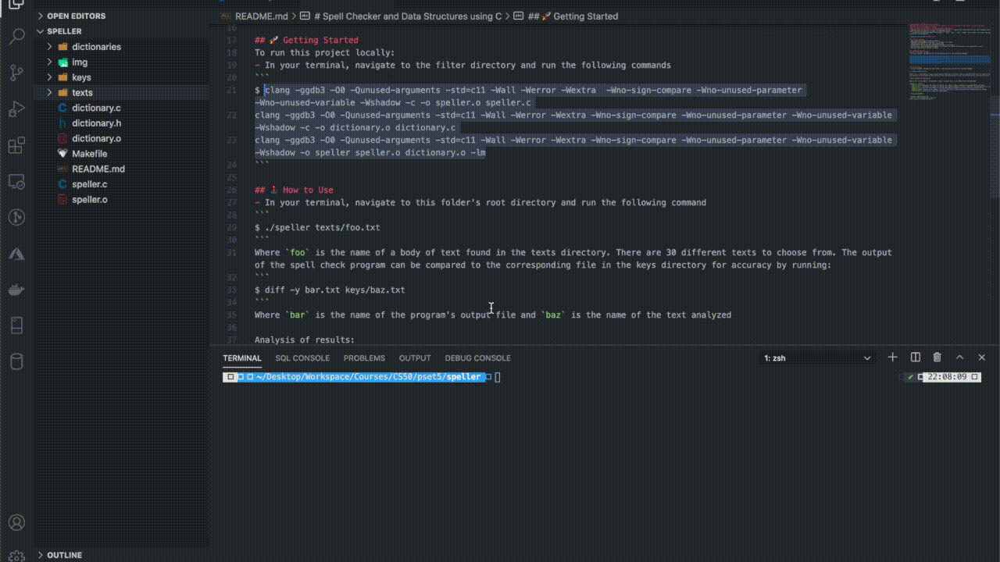

# Spell Checker and Data Structures using C
### Homework from [Harvard's Introduction to Computer Science CS50 hosted on eDX](https://www.edx.org/course/cs50s-introduction-to-computer-science)
### 🎓 [Problem Set 4](https://cs50.harvard.edu/x/2020/psets/5/)
- [Speller](https://cs50.harvard.edu/x/2020/psets/5/speller/): Program that spell-checks a file after loading a dictionary of words from disk into memory. Includes run-time data output.
- I wrote the following functions in dictionary.c: `load`, `hash`, `size`, `check`, and `unload`. The other code and files were provided by the instructor.



## 💡Lessons Learned
- Hash table and linked list data strutures
- Implementing knowledge of pointers `*n` and next `n -> next`
- Hashing words from a txt file into a hash table
- Reading into and subsequently unloading dictionary from memory
- Using `malloc` and command-line argument `$ valgrind` to prevent leaking memory and segmentation faults
- Run time optimization and Big O analysis

## 🚀 Getting Started
To run this project locally:
- In your terminal, navigate to the filter directory and run the following commands
```
$	clang -ggdb3 -O0 -Qunused-arguments -std=c11 -Wall -Werror -Wextra  -Wno-sign-compare -Wno-unused-parameter -Wno-unused-variable -Wshadow -c -o speller.o speller.c
clang -ggdb3 -O0 -Qunused-arguments -std=c11 -Wall -Werror -Wextra -Wno-sign-compare -Wno-unused-parameter -Wno-unused-variable -Wshadow -c -o dictionary.o dictionary.c
clang -ggdb3 -O0 -Qunused-arguments -std=c11 -Wall -Werror -Wextra -Wno-sign-compare -Wno-unused-parameter -Wno-unused-variable -Wshadow -o speller speller.o dictionary.o -lm
```

## 🕹 How to Use
- In your terminal, navigate to this folder's root directory and run the following command
```
$ ./speller texts/foo.txt
```
Where `foo` is the name of a body of text found in the texts directory. There are 30 different texts to choose from. The output of the spell check program can be compared to the corresponding file in the keys directory for accuracy by running:
```
./speller texts/tolstoy.txt > bar.txt
$ diff -y bar.txt keys/baz.txt
```
Where `bar` is the name of the program's output file and `baz` is the name of the text analyzed

Analysis of results:
- `TIME IN load` represents the number of seconds that speller spends executing the implementation of load.
- `TIME IN check` represents the number of seconds that speller spends, in total, executing the implementation of check.
- `TIME IN size` represents the number of seconds that speller spends executing the implementation of size.
- `TIME IN unload` represents the number of seconds that speller spends executing the implementation of unload. 
- `TIME IN TOTAL` is the sum of those four measurements.

- Quick use examples
```
./speller texts/tolstoy.txt
./speller texts/tolstoy.txt > your.txt
diff -y your.txt keys/tolstoy.txt
```